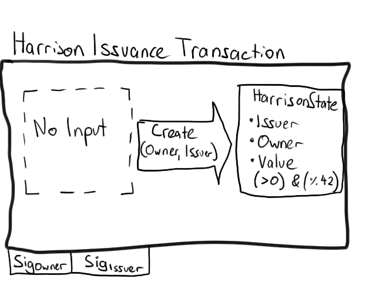

# corda-learning-things
Cool repo.

`gradle deployNodes` 
`gradle test integrationTest smokeTest` with any combination of `test`, `integrationTest` and `smokeTest`

Issue from Corporation to Bank of Harrison 
`start HarrisonIssueRequestFlow harrisonValue: 84, otherParty: "O=BankOfHarrison,L=Tokyo,C=JP"`

Check vault on Corporation 
`run vaultQuery contractStateType: com.template.HarrisonState`

### Learning
https://github.com/corda/cordapp-example/blob/release-V2/kotlin-source/src/test/kotlin/com/example/contract/IOUContractTests.kt
